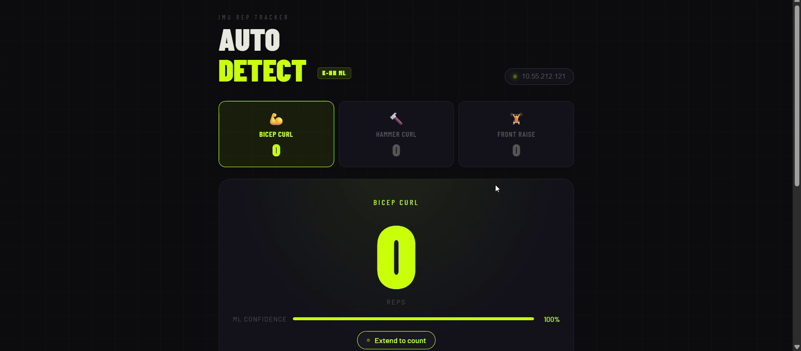

# IMU Based Smart Exercise Rep Counter with Automatic Workout Detection

A wearable real-time exercise tracking system that uses a single **MPU6050 IMU sensor** and an **ESP8266 NodeMCU** to automatically detect and count exercises using a browser-based machine learning pipeline.

The system classifies exercises in real time using a **k-Nearest Neighbour (k-NN)** classifier running entirely in JavaScript with no cloud dependency.

---

## Features

- Real-time exercise detection and repetition counting
- Automatic classification of:
  - Bicep Curl
  - Hammer Curl
  - Front Raise
- Browser-based dashboard
- Live IMU sensor monitoring
- WebSocket-based wireless data streaming
- Motion filtering and stability detection
- Real-time probability visualization
- Machine learning inference directly in the browser

---

# Website Interface

<p align="center">
  
</p>

---

## Hardware Used

| Component | Purpose |
|---|---|
| ESP8266 NodeMCU | Main microcontroller |
| MPU6050 IMU | Accelerometer + Gyroscope |
| Power Bank / USB | Power supply |
| WiFi Hotspot | Wireless communication |

---

## Hardware Connections

| MPU6050 | ESP8266 |
|---|---|
| VCC | 3.3V |
| GND | GND |
| SCL | D1 (GPIO5) |
| SDA | D2 (GPIO4) |
| AD0 | GND |

---

## System Architecture

```text
MPU6050 IMU
     │
     ▼
ESP8266 NodeMCU
(WebSocket Server)
     │
 WiFi JSON Stream
     ▼
Browser Dashboard
     ├── Feature Extraction
     ├── k-NN Classifier
     ├── FSM Rep Counter
     └── Live Visualization
```

---

# Working

## 1. IMU Data Acquisition

The MPU6050 IMU sensor is mounted on the user’s forearm and continuously measures:

- 3-axis Accelerometer Data (`ax`, `ay`, `az`)
- 3-axis Gyroscope Data (`gx`, `gy`, `gz`)

The ESP8266 reads the sensor values over the I2C interface at a sampling rate of **20 Hz**.

---

## 2. Wireless Data Transmission

The ESP8266 acts as a WebSocket server and broadcasts IMU readings to the browser every 50 ms using WiFi.

Example JSON packet:

```json
{
  "ax": -0.93,
  "ay": 0.16,
  "az": 0.23,
  "gx": -26.2,
  "gy": -29.0,
  "gz": 3.6
}
```

This enables real-time wireless communication between the wearable device and the browser dashboard.

---

## 3. Rolling Window Buffer

The browser continuously stores incoming IMU samples inside a rolling window of recent sensor data.

The rolling window contains:

- 20–40 recent IMU samples
- Current movement history
- Temporal motion patterns

This provides enough information for accurate movement classification.

---

## 4. Motion Detection

Before running the machine learning classifier, the system checks whether significant movement is occurring.

The motion gate filters out:

- Idle states
- Random noise
- Unwanted hand movement

If motion is not detected:

- Classification is skipped
- Rep counting is paused
- System remains idle

This reduces false exercise detections.

---

## 5. Feature Extraction

For every rolling sensor window, the browser extracts **33 handcrafted IMU features**.

### Statistical Features

For each IMU axis:

- Mean
- Standard Deviation
- Range
- Maximum Value
- Minimum Value

These features describe:

- Motion intensity
- Direction changes
- Rotation behaviour
- Exercise dynamics

### Cross-Axis Features

Additional features include:

- Gyroscope axis ratios
- Forearm roll consistency
- Rotation spike detection

These are critical for distinguishing between exercises with similar motion patterns.

---

## 6. Feature Normalization

The extracted features are normalized using z-score normalization:

```math
\hat{f_i} = \frac{f_i - \mu_i}{\sigma_i}
```

Normalization ensures all features remain within comparable numerical ranges before classification.

---

## 7. Machine Learning Classification

The system uses a **k-Nearest Neighbour (k-NN)** classifier with:

- `k = 3`
- Euclidean distance metric

The classifier compares the current feature vector against stored training samples and predicts:

- Bicep Curl
- Hammer Curl
- Front Raise

The dashboard also displays live probability values for each exercise class.

---

## 8. Stability Filtering

To prevent rapid switching between exercise labels caused by noise, the system applies stability filtering.

A new exercise is accepted only if:

- Multiple consecutive predictions match
- Prediction confidence remains stable

This ensures smoother and more reliable exercise detection.

---

## 9. Rep Counting using FSM

Once an exercise is locked, a Finite State Machine (FSM) tracks movement phases and counts repetitions.

### Bicep Curl / Hammer Curl

The system tracks:

- Upward arm motion
- Downward arm motion
- Full repetition cycles

using acceleration thresholds.

### Front Raise

The system uses a different IMU axis to monitor vertical arm elevation.

A repetition is counted only after a complete movement cycle is detected.

---

## 10. Live Dashboard Visualization

The browser dashboard displays:

- Current detected exercise
- Repetition count
- Confidence probabilities
- Motion status
- Raw IMU values
- Real-time waveform graphs

All processing runs entirely inside the browser without requiring any cloud processing or backend ML server.

---

## End-to-End Workflow

```text
MPU6050 Sensor
       │
       ▼
ESP8266 Reads IMU Data
       │
       ▼
WebSocket Transmission
       │
       ▼
Browser Receives IMU Stream
       │
       ▼
Rolling Window Buffer
       │
       ▼
Motion Detection
       │
       ▼
Feature Extraction
       │
       ▼
Feature Normalization
       │
       ▼
k-NN Classification
       │
       ▼
Stability Filtering
       │
       ▼
FSM Rep Counter
       │
       ▼
Dashboard Visualization
```

---

## Dashboard Features

- Live repetition counters
- Exercise auto-detection
- Probability bars for each exercise
- Motion activity indicator
- Real-time waveform chart
- Raw IMU sensor display
- Event logging system

---

## Technologies Used

- ESP8266 Arduino Firmware
- MPU6050 IMU Sensor
- HTML/CSS/JavaScript
- WebSockets
- k-Nearest Neighbour Machine Learning
- Browser-based signal processing

---

## Performance

| Metric | Result |
|---|---|
| Classification Accuracy | 97.4% |
| Sampling Rate | 20 Hz |
| Exercises Supported | 3 |
| Feature Count | 33 |
| Wireless Streaming | Real-time |

---

## Future Improvements

- Multi-user training support
- BLE mobile application
- Additional exercise detection
- Rep quality analysis
- Sensor auto-calibration
- Online adaptive learning

---


## How It Works

1. MPU6050 captures accelerometer and gyroscope data
2. ESP8266 streams IMU data using WebSockets
3. Browser receives live sensor values
4. Features are extracted from rolling windows
5. k-NN classifier predicts exercise type
6. FSM logic counts repetitions
7. Dashboard updates in real time
